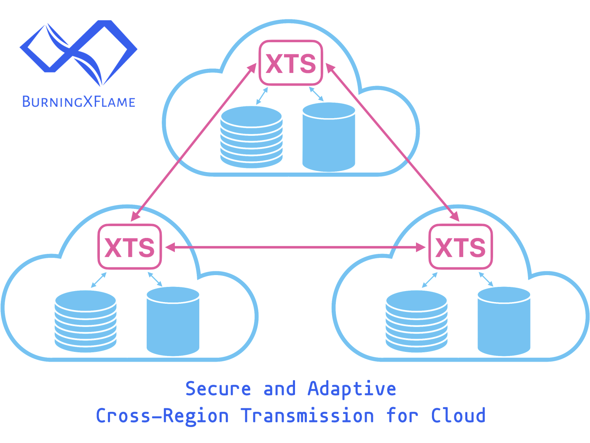

# XTS - Secure and Adaptive Cross-Region Transmission for Cloud

XTS is a Cloud-Native Cross-Region Transmission Service which
improves the security of Cross-Region Transmission,
and provides Adaptive and Fair Hierarchical Transmission Control.

## Intro

### Cross-Region Transmission

Common use cases of cross-region transmission are

- cross-region replication for disaster recovery of DB, MQ, Object Storage, etc
- cross-region transmission between instances of active-active or multi-active services
- cross-region communication between services

### XTS Improves the Security of Cross-Region Transmission

#### Security Risks of Cross-Region Transmission

Usually you have to expose a public IP-port to the public Internet for each Stateless Service (or each Pod of a StatefulSet) which needs cross-region transmission, in order for a Service (or Pod) to be located and connected across region.
If there're, say, thousands of such Services (or Pods), you have to expose thousands of public IP-ports to the public Internet, which means there are thousands of points of attack.

#### Secure Cross-Region Transmission

XTS improves the security of cross-region transmission in several ways.

- XTS establishes secure tunnels between regions, and enables cross-region transmission without exposing public IP-ports for your services which need cross-region transmission.
- XTS minimizes attack surface. Only one public IP-port, i.e. the public IP-port of XTS, of each region is exposed to the public Internet.
- XTS rejects connections from the public Internet, except connections from XTS of another region of yours.
- XTS protects your services from being exposed to the public Internet. Your services can only be accessed from within your regions.
- XTS has builtin abilities to defend against DDoS attacks, to defend against slow attacks, to close idle connections, etc.

### Adaptive and Fair Hierarchical Transmission Control

See [ATC](https://www.bxflame.com/xts/doc/atc/) for details.

### Effortlessly Scale With Your Business

XTS effortlessly scales as your business grows. XTS is Truly Distributed, Load Balanced and Horizontally Scalable. This architecture provides the best scalability and reliability. In theory, there’s no scalability cap, i.e. you can achieve unlimited throughput by specifying an unlimited number of replicas.

### Reliability

- Zero downtime during scaling out/in.
- Zero downtime during upgrade.
- All established connections remain intact on config changes.
- Zero downtime on temporary errors. Auto-recover on temporary errors.
- Zero downtime on process crash. Auto-recover on process crash.

### Easy to Use

The experience of accessing services in other regions is like accessing services in the same region.

## Use

### Define a Region

Define a Region via CR:

```yaml
apiVersion: ext.burningxflame.github.com/v1
kind: Region
metadata:
  namespace: <ns>
  name: <name>
spec:
  # the external (i.e. public) address of XTS of the destination region
  externalAddr: <host>:<port>
  # other fields ...
```

Define a `Region` for each destination region.
Usually you define `Region`s to be referenced by `Dst`s.

### Define a Destination

Define a Destination via CR:

```yaml
apiVersion: ext.burningxflame.github.com/v1
kind: Dst
metadata:
  namespace: <ns>
  name: <name>
spec:
  # the internal port of XTS for the destination
  internalPort: <port>
  # the destination region
  dstRegion: <ns>/<name>
  # the destination address in the destination region
  dstAddr: <host>:<port>
```

Define a `Dst` for each destination.
XTS will listen on `internalPort`. All traffic to `internalPort` will be routed to `dstAddr` in `dstRegion`.
`dstRegion` refers to a `Region`. The format is `<namespace>/<name>`.

### Access a Destination

The experience of accessing services in other regions is like accessing services in the same region.

1. Connect to a `Dst` by connecting to `<xts-dns-name>:<internalPort>`.
   `<xts-dns-name>` is the DNS name generated by K8S for XTS, and defaults to `xts.<namespace>.svc.cluster.local`, and can be abbreviated to `xts.<namespace>`, and can be abbreviated to `xts` if the service which initiates the connection is deployed in the same namespace as XTS.
   `<internalPort>` is the `internalPort` of the `Dst`.

2. XTS will establish a secure tunnel to the destination, as if the service which initiates the connection is directly connected to the destination.

3. Proceed to data transmission.

### RESTful

RESTful API is also available. To learn more, view the [RESTful API docs](https://www.bxflame.com/xts/doc/rest/).

## More

To learn more, view the [complete list of all features](https://www.bxflame.com/xts/doc/features/).
